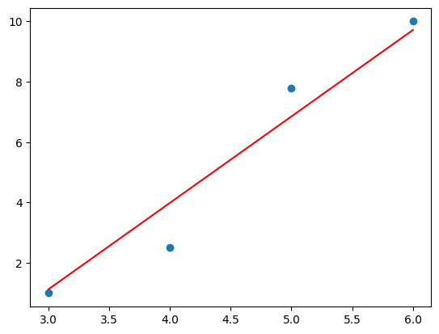
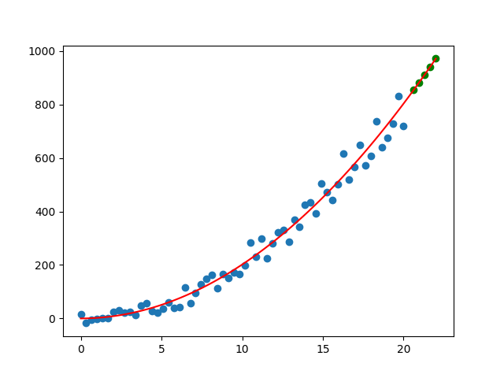
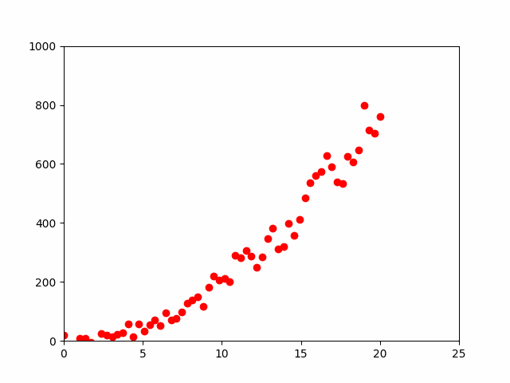

# Predicting 1D Path with Gradient Descent
## What is Gradient Descent
Gradient descent is an optimization technique used to find the minimum of a function. In machine learning and deep learning, it's commonly used to minimize the error of a model. The idea is to iteratively adjust model parameters in the direction of steepest descent (negative gradient) to reach a local or global minimum. This process continues until the algorithm converges or reaches a specified number of iterations. Gradient descent is widely used for training machine learning models, such as neural networks, by updating weights to reduce prediction errors.
### How it works :
1. Initialization: The algorithm starts with an initial guess for the parameters (often chosen randomly or set to specific values).
2. Compute the Gradient: The gradient of the cost function with respect to the parameters is calculated. This gradient points in the direction of the steepest increase in the cost function.
3. Update Parameters: The parameters are adjusted by moving in the opposite direction of the gradient to reduce the cost. The size of the step is controlled by a parameter called the "learning rate."
4. Repeat: Steps 2 and 3 are repeated iteratively for a specified number of iterations or until a convergence criterion is met (e.g., the cost function changes very slowly).
5. Convergence: Gradient descent stops when one of the stopping criteria is met, such as a maximum number of iterations, a sufficiently small change in the cost function, or achieving a predefined level of accuracy.

## Task 3 :
Write a python code to fit a line on the given points using gradient descent algorithm
3,1
4,2.5
5,7.8
6,10
 
 Prediction:  
### Status : Completed

## Task 4 :
This repository contains Python code that generates 50-60 random x, y coordinate points, where x represents a timestamp and y represents the position in a 1D plane. We use linear or polynomial regression to predict the next 5 points in the path. The code utilizes the matplotlib library to create an animation that visualizes the entire path over time.

## Steps to Complete the Task
### Dataset Generation
The code generates a synthetic dataset of 50-60 data points with random x and y coordinates. The y-coordinate is calculated as a quadratic function of x, with some added random noise. The dataset simulates the position of an object in a 1D plane over time.
### Gradient Descent
Gradient descent is a key component of this project, used for fitting a quadratic curve to the dataset. The objective is to find the best-fitting quadratic equation of the form y = ax^2 + bx + c that minimizes the error between the predicted values and the actual data points. The key parameters for gradient descent are as follows:
a, b, and c: The coefficients of the quadratic equation.
learningRate: A small value that controls the step size during optimization.
The gradient descent process iteratively updates the coefficients a, b, and c to minimize the error between the predicted and actual data points. This process is repeated for a specified number of iterations (in this case, 200 iterations).
Prediction:  
Next 5 points are represented by green color
### Visualization and Animation
The code utilizes the matplotlib library to create a visualization of the dataset and the fitted quadratic curve. Additionally, it generates an animation to display the curve's progression over time. The animation helps visualize how the quadratic curve fits the data points during the gradient descent optimization process.
The animation is created using FuncAnimation from matplotlib.animation, and it shows the gradual convergence of the quadratic curve to the optimal fit.

 Prediction:  
### Status: Completed
## Conclusion
This project demonstrates the use of gradient descent to fit a quadratic curve to a dataset and creates an animated visualization to understand the optimization process. The code can be adapted to different datasets and regression techniques for various predictive tasks.
